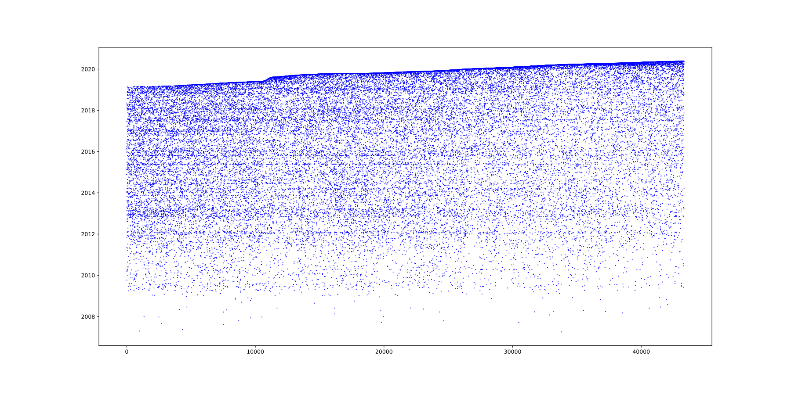

# Twitter Fake Followers Detector

Inspiration: https://www.nytimes.com/interactive/2018/01/27/technology/social-media-bots.html

Visualize the correlation between the creation date and the following order. Look for distinct patterns and mysterious “families” of accounts.

## Built with:

* Python
* Pandas
* Twint
* Matplotlib

## Results:

